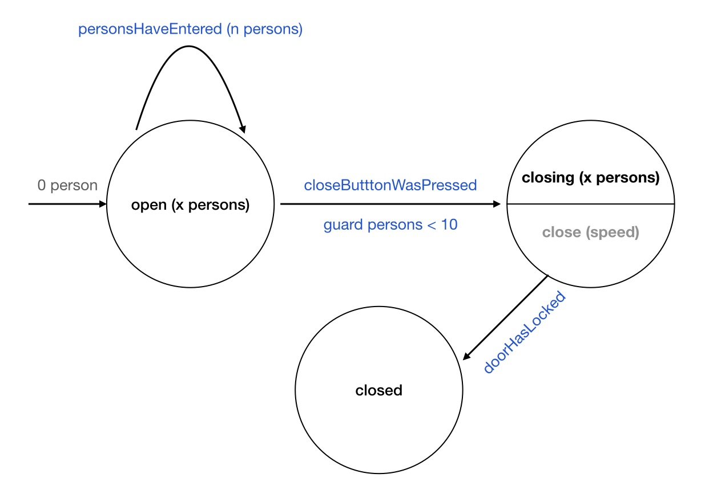

# Async State Machine
**Async State Machine** aims to provide a way to structure an application thanks to state machines. The goal is to identify the states and the side effects involved in each feature and to model them in a consistent and scalable way thanks to a DSL.

```swift
let stateMachine = StateMachine(initial: .state1) {
  When(state: .state1) {
    Execute(output: .output1)
  } transitions: {
      On(event: .event1) { Transition(to: .state2) }
      On(event: .event2) { Transition(to: .state3) }
      On(event: .event3(value:)) { value in Transition(to: .state4(value)) }
  }
     
  When(state: .state2(value:)) { value in
    Execute.noOutput
  } transitions: { value in
         …
  }
}
```

## Key points:
- Each feature is a [Moore state machine](https://en.wikipedia.org/wiki/Moore_machine): no need for a global store
- State machines are declarative: a DSL offers a natural and concise syntax
- Swift concurrency is at the core:
	- A state machine is an `AsyncSequence`
	- Each side effect runs inside a `Task` that benefit from cooperative cancellation
	- Concurrent transitions can suspend
- State machines are built in complete isolation: tests dont require mocks
- Dependencies are injected per side effect: no global bag of dependencies
- State machines are not UI related: it works with UIKit or SwiftUI

## A Simple Example
As a picture is worth a thousand words, here’s an example of a state machine that drives the opening of an elevator‘s door:



<br>

### How does it read?

- **INITIALLY**, the elevator is `open` with 0 person inside
- **WHEN** the state is `open`, **ON** the event `personsHaveEntered`, the new state is `open` with `n + x` persons.
- **WHEN** the state is `open`, **ON** the event `closeButtonWasPressed`, the new state is `closing` if there is less than 10 persons (elevator’s capacity is limited).
- **WHEN** the state is `closing`, the `close` action is executed (the door can close at different speeds).
- **WHEN** the state is `closing`, **ON** the event `doorHasLocked`, the new state is *closed*.

### What defines this state machine?

- The elevator can be in 3 exclusive **states**: `open`, `closing` and `closed`. _This is the finite set of possible **states**. The initial state of the elevator is `open` with 0 person inside._
- The elevator can receive 3 **events**: `personsHaveEntered`, `closeButtonWasPressed` and `doorHasLocked`. _This is the finite set of possible **events**._
- The elevator can perform 1 **action**: `close` the door when the state is `closing` and the number of persons is less than 10. The speed of the doors is determined by the number of persons inside. _This is the finite set of possible **outputs**._
- The elevator can go from one state to another when events are received. _This is the finite set of possible **transitions**._

The assumption we make is that almost any feature can be described in terms of state machines. And to make it as simple as possible, we use a Domain Specific Language.

## The state machine DSL

Here’s the translation of the aforementioned state machine using enums and the **Async State Machine** DSL:

```swift
enum State: DSLCompatible {
  case open(persons: Int)
  case closing(persons: Int)
  case closed
}

enum Event: DSLCompatible {
  case personsHaveEntered(persons: Int)
  case closeButtonWasPressed
  case doorHasLocked
}

enum Output: DSLCompatible {
  case close(speed: Int)
}

let stateMachine = StateMachine(initial: State.open(persons: 0)) { 
  When(state: State.open(persons:)) { _ in
    Execute.noOutput
  } transitions: { persons in
    On(event: Event.personsHaveEntered(persons:)) { newPersons in
      Transition(to: State.open(persons: persons + newPersons))
    }

    On(event: Event.closeButtonWasPressed) { 
      Guard(predicate: persons < 10)
    } transition: { 
      Transition(to: State.closing(persons: persons))
    }
  }
    
  When(state: State.closing(persons:)) { persons in
    Execute(output: Output.close(speed: persons > 5 ? 1 : 2))
  } transitions: { _ in
    On(event: Event.doorHasLocked) {
      Transition(to: State.closed)
    }
  }
}
```

The only requirement to be able to use enums with the DSL is to have them conform to *DSLCompatible*.

## The Runtime

The DSL aims to describe a formal state machine: no side effects, only pure functions!

The `StateMachine` declares **output** _values_ to describe the _intent_ of side effects to be performed, but the _implementation_ of those side effects are declared in the `Runtime` where one can map outputs to side effect functions. 

(Amongst other benefits, this decoupling allows for easier testing of your State Machine without depending on the implementation of the side effects.)


```swift
func close(speed: Int) async -> Event {
  try? await Task.sleep(nanoseconds: UInt64(1_000_000_000 / speed))
  return .doorHasLocked
}

let runtime = Runtime<State, Event, Output>()
  .map(output: Output.close(speed:), to: close(speed:))
```

Side effects are `async` functions that return either a single `Event`, or an `AsyncSequence<Event>`. Every time the state machine produces the expected `output`, the corresponding side effect will be executed.

In addition, the Runtime can register _middleware_ functions executed on any `state` or `event`:

```swift
let runtime = Runtime<State, Event, Output>()
  .map(output: Output.close(speed:), to: close(speed:))
  .register(middleware: { (state: State) in print("State: \(state)") })
  .register(middleware: { (event: Event) in print("Event: \(event)") })
```

The `AsyncStateMachineSequence` can then be instantiated:

```swift
let sequence = AsyncStateMachineSequence(
  stateMachine: stateMachine,
  runtime: runtime
)

for await state in sequence { … }

await sequence.send(Event.personsHaveEntered(persons: 3))
```

## Swift concurrency at the core

**Async State Machine** is 100% built with the Swift 5.5 concurrency model in mind.

### Transitions

- Transitions defined in the DSL are `async` functions; they will be executed in a non blocking way.
 - Event sending is `async`: `sequence.send(Event.closeButtonWasPressed)` will suspend until the event can be consumed. If an event previously sent is being processed by a transition, the next call to `send(_:)` will `await`. This prevents concurrent transitions to happen simultaneously (which could otherwise lead to inconsistent states).

### Side effects

- Side effects are `async` functions executed in the context of `Tasks`.
- Task priority can be set in the Runtime: `.map(output: Output.close(speed:), to: close(speed:), priority: .high)`.
- Collaborative task cancellation applies: when the state machine parent task is cancelled, every side effect task will be marked as cancelled.

### Async sequence

- `AsyncStateMachineSequence` benefits from all the operators associated to `AsyncSequence` (`map`, `filter`, …). (See also [swift async algorithms](https://github.com/apple/swift-async-algorithms))

## How to inject dependencies?

Most of the time, side effects will require dependencies to perform their duty. However, **Async State Machine** expects a side effect to be a function that eventually takes a parameter (from the `Output`) and returns an `Event` or an `AsyncSequence<Event>`. There is no place for dependencies in their signatures.

There are several ways to overcome this:

- Make a business object that captures the dependencies and declares a function that matches the side effect’s signature:

```swift
class ElevatorUseCase {
  let engine: Engine
	
  init(engine: Engine) { self.engine = engine }

  func close(speed: Int) async -> Event {
    try? await Task.sleep(nanoseconds: UInt64(self.engine.delay / speed))
	 return .doorHasLocked
  }
}

let useCase = ElevatorUseCase(engine: FastEngine())
let runtime = Runtime<State, Event, Output>()
  .map(output: Output.close(speed:), to: useCase.close(speed:))
```

- Make a factory function that provides a side effect, capturing its dependencies:

```swift
func makeClose(engine: Engine) -> (Int) async -> Event {
  return { (speed: Int) in
    try? await Task.sleep(nanoseconds: UInt64(engine.delay / speed))
	 return .doorHasLocked
  }
}

let close = makeClose(engine: FastEngine())
let runtime = Runtime<State, Event, Output>()
  .map(output: Output.close(speed:), to: close)
```

- Use the provided `inject` function (preferred way verbosity wise):

```swift
func close(speed: Int, engine: Engine) async -> Event {
  try? await Task.sleep(nanoseconds: UInt64(engine.delay / speed))
  return .doorHasLocked
}

let closeSideEffect = inject(dep: Engine(), in: close(speed:engine:))
let runtime = Runtime<State, Event, Output>()
  .map(output: Output.close(speed:), to: closeSideEffect)
```

## Testable in complete isolation

State machine definitions do not depend on any dependencies, thus they can be tested without using mocks. **Async State Machine** provides a unit test helper making it even easier:

```swift
XCTStateMachine(stateMachine)
  .assertNoOutput(when: .open(persons: 0))
  .assert(
    when: .open(persons: 0),
    on: .personsHaveEntered(persons: 1),
    transitionTo: .open(persons: 1)
  )
  .assert(
    when: .open(persons: 5),
    on: .closeButtonWasPressed,
    transitionTo: .closing(persons: 5)
  )
  .assertNoTransition(when: .open(persons: 15), on: .closeButtonWasPressed)
  .assert(when: .closing(persons: 1), execute: .close(speed: 2))
  .assert(
    when: .closing(persons: 1),
    on: .doorHasLocked,
    transitionTo: .closed
  )
  .assertNoOutput(when: .closed)
```

## Using Async State Machine with SwiftUI and UIKit

No matter the UI framework you use, rendering a user interface is about interpreting a state. You can use an `AsyncStateMachineSequence` as a reliable state factory, exposing the state with the provided `ViewState`.

A simple and naive SwiftUI usage could be:

```swift
struct ContentView: View {
  @ObservedObject viewState: ViewState<State, Event, Output>

  var body: some View {
    VStack {
      Text(self.viewState.state.description)
      Button { 
        Task {
          await self.viewState.send(Event.personsHaveEntered(persons: 1))
        }
      } label: { 
        Text("New person")
      }
      Button { 
        Task {
          await self.viewState.send(Event.closeButtonWasPressed)
        }
      } label: { 
        Text("Close the door")
      }
    }.task {
      await viewState.start()
    }
  }
}

…

let viewState = ViewState(myAsyncStateMachine)
ContentView(viewState: viewState)
```

With UIKit, a simple and naive approach would be:

```swift
let task: Task<Void, Never>!
let viewState: ViewState<State, Event, Output>!
let cancellable = AnyCancellable()

override func viewDidLoad() {
  super.viewDidLoad()
  self.task = Task { [weak self] in
    await self?.viewState.start()
  }
  
  self.cancellable = self.viewState.$state.sink { [weak self] state in
  	self?.render(state: state)
  }
}

func render(state: State) {
  …
}

func deinit() {
  self.task.cancel()
}
```

## Extras

### Conditionally resumable `send()` function 

Allows to send an event while awaiting for a specific state or set of states to resume.

```swift
await viewState.send(
  .closeButtonWasPressed,
  resumeWhen: .closed
)`
```

### Side effect cancellation

Make `close(speed:)` side effect execution be cancelled when the state machine produces any new states. It is also possible to cancel on a specific state.

```swift 
Runtime.map(
	output: Output.close(speed:),
	to: close(speed:),
	strategy: .cancelWhenAnyState
)
```

### States set

Allows to factorize the same transition for a set of states.

```swift
When(states: OneOf {
	State.closing(persons:),
	State.closed
}) { _ in
	Execute.noOutput
} transitions: {
	On(event: Event.closeButtonWasPressed) { _ in
		Transition(to: State.opening)
	}
}`
```

### SwiftUI bindings

Allows to create a SwiftUI binding on the current state, sending an Event when the binding changes.

```swift
self.viewState.binding(send: .closeButtonWasPressed)
```

Allows to create a SwiftUI binding on a property of the current state, sending an Event when the binding changes.

```swift
self.viewState.binding(keypath: \.persons, send: .closeButtonWasPressed)
```

### Connecting two state machines

This will send the event `OtherEvent.refresh` in the other state machine when the first state machine's state is `State.closed`.

```swift
let pipe = Pipe<OtherEvent>()

let runtime = Runtime<State, Event, Output>()
  ...
  .connectAsSender(to: pipe, when: State.closed, send: OtherEvent.refresh)
	

let otherRuntime = Runtime<OtherState, OtherEvent, OtherOutput>()
  ...
  .connectAsReceiver(to: pipe)
```
